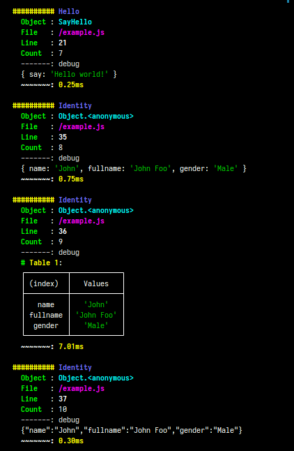

# deBuggy

> **Warning**
> *This is an experimental.*

Debug your code into terminal with ``file location`` and ``line info`` where your placed it, NodeJS only.

> **_Does you know where you place debugging code in your script?_**

| Terminal Capture 1 | Terminal Capture 2 | Terminal Capture 3 |
| ---- | -------| ----- |
|  |  |  |

## Installation

```sh
npm i debuggy --save-dev
```

## Environment

```sh
DEBUG=debuggy node app.js
```

```sh
DEBUG=debuggy nodemon app.js
```

## Usage

```js
const debuggy = require('debuggy')

// or global, recomended for application using ExpressJS, etc.
global.debuggy = debuggy.debug
```

```js 
// try it first
const hello = { say: 'Hello world!' }

debuggy('My first debuggy')(hello)

// leave blank results as `deBuggy` as a label by default.
debuggy()(hello)
```
Results in terminal:

```bash
########## deBuggy
  Object : Object.<anonymous>
  File   : /example.js
  Line   : 9
  Count  : 1
  -------: debug
  Hello!
  ~~~~~~~: 0.35ms
```

## Custom Format

Support multiple arguments, results as group:

```js
let data = {
  name: 'John',
}

debuggy('My first debuggy %g')(hello, data)
```

Shows as table:

```js
let data = {
  name: 'John',
  fullname: 'John Foo',
}

debuggy('My first debuggy %t')(data)
debuggy('My first debuggy %t')(data, other)
```

Shows as JSON:

```js
debuggy('My first debuggy %j')(data)
```

Combination:

```js
debuggy('My first debuggy %g %j')(data)
debuggy('My first debuggy %g %t')(data)
```

Grouping:

```js
debuggy('My first debuggy', ['Group 1 %t', 'Group 2 %j'])(data, other)
```

## Options

```js
const debuggy = require('debuggy')

debuggy.options({
    shows: 'MODEL,AUTH',
    templateActive: 'myCustom',
    templates: {
        myCustom: {
            head: ({template, tokens, label, mode}, args) => {
                console.log(template(`<hy>###### <s>{label}`, tokens))
                console.log(template(`<hg>#<s> {file}:{line}:{column}`, tokens))
            },
            body: (args, {label, mode}) => {
              console.log(...args)
            },
        },
        full: {
          all: ({template, tokens, label, mode}, args, stacksData) => {
            // ....
          }
        }
    }
})

// or global
global.debuggy = debuggy.debug
```
### Tags

#### ``options.shows``

Shows only spesific **_tag_** given:

```js
debuggy.options({
  // Separated by (|., )
  // Recomended to writing tag name with (A-Z_-) characters.
  shows: 'MODEL|AUTH|SQL_MODEL', // remove ``options.shows`` or leave blank ``''`` to disable.
}

debuggy.debug('[MODEL] My first debuggy')(data)
// the tag [MODEL] above will hidden in label.
```

### Templates

#### ``options.templates``

```js
// format:
const myCustomTemplate = {
  head: () => {}, // optional
  body: () => {}, // optional
}

const otherCustomTemplate = {
  head: () => {}, // optional
  body: () => {}, // optional
}

debuggy.options({
  shows: 'MODEL,AUTH',
  templateActive: 'myCustomTemplate', // default template
  templates: {
    myCustomTemplate,
    otherCustomTemplate,
    totalReplacementTemplate,
  }
}

// Use with specific template
debuggy('My first debuggy', 'otherCustomTemplate')(data)
debuggy('My first debuggy', ['Group 1', 'Group 2'], 'otherCustomTemplate')(data, other_data)

```

#### Params for ``head`` & ``body``

> Param: ``args``, refers to ``console.log(...arguments)`` or your variable/object that used to debugging.

> Param: ``object``, utilities or several data you needs to build a template.

```js
myCustomTemplate.head = ({ template, tokens, mode }, args) => {
  const {
    label,   // {label}
    object,  // {object}, current function name or wrapper.
    file,    // {file}
    line,    // {line}
    column,  // {column}
  } = tokens

  // with template, always added `<s>` as suffix.
  console.log(template('<hy>{label}: {file}:{line}', tokens))

  // without tags, just use colors
  console.log(template('<hb>Hello world'))
}

myCustomTemplate.body = (args, { template, tokens, label, mode }) => {
  // recomended
  console.log(...args)
  // or
  // console.log(args[0], args[1], args[n], ....)
}

```

> *Both of the second params are optional.*

Replace all, then do whatever you want.

```js
totalReplacementTemplate.all = ({ template, tokens, label, mode }, args, data) => {

  console.log(data)

  /*
  {
    line: 21,
    file: '/example.js',
    object: 'SayHello',
    column: 5,
    label: '<he>Hello<s>'
  }
  */

}
```

## Colors

```js
const colorsCode = {
    s: 0, // reset
    h: 1, // bright
    u: 4, // underline,
    k: 5, // blink
    n: 8, // hidden
    // ------------- Foreground
    b: 30, // black
    r: 31, // red
    g: 32, // green
    y: 33, // yellow
    e: 34, // blue
    m: 35, // magenta
    c: 36, // cyan
    w: 37, // white,
    // ------------- Background. Similar to foreground colors, but `uppercase`.
    B: 40, // black
    R: 41, // red
    G: 42, // green
    Y: 43, // yellow
    E: 44, // blue
    M: 45, // magenta
    C: 46, // cyan
    W: 47, // white,
}
```

### Usage

```js
// fgYellow color text
debuggy('<y>My first debuggy')(data)

// Light yellow color text, combination: [y]fgYellow, [h]bright
debuggy('<hy>My first debuggy')(data)

// combination: [B]bgBlack, [y]fgYellow, [h]bright
debuggy('<hBy>My first debuggy')(data)

// reset <s>, optional
debuggy('<Byh>My first debuggy<s>')(data)

```

## Notes

1. Recomended to use one instance. Use ``global`` for multiple files included.
2. Writing ``debuggy()`` with one line. 
3. More information about ``console`` plase visit [NodeJS Console API](https://nodejs.org/api/console.html) or [MDN Console API](https://developer.mozilla.org/en-US/docs/Web/API/Console_API).
4. More examples, see ``examples.js`` or run ``npm run debug`` in your terminal.

*Poor my English, sorry.*

## LICENSE

**ISC** License.
